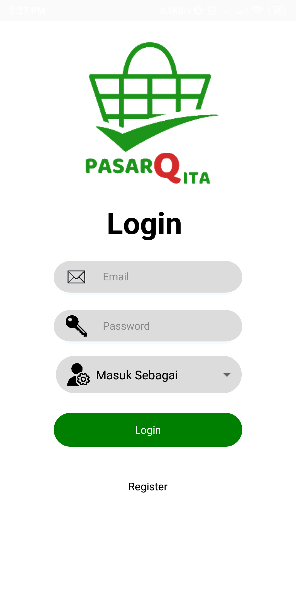
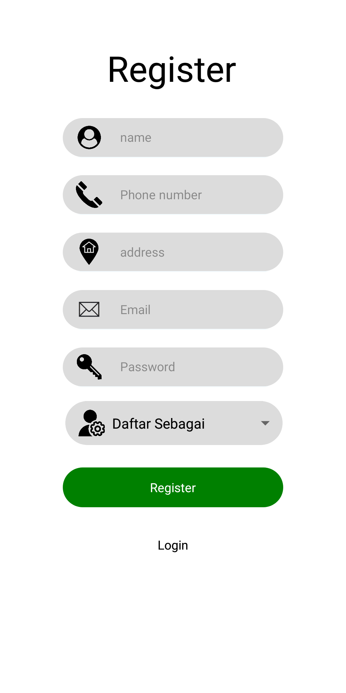
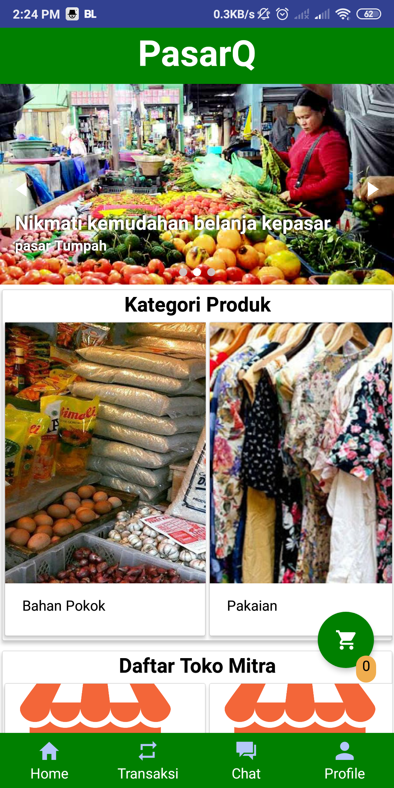
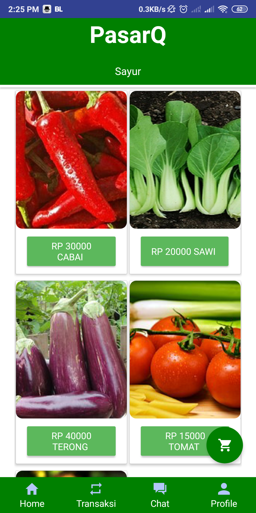
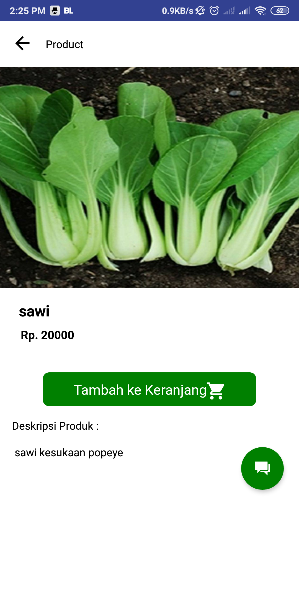
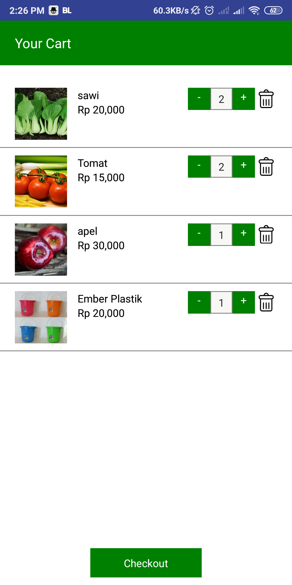
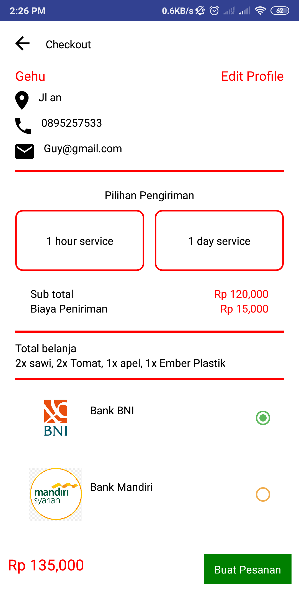
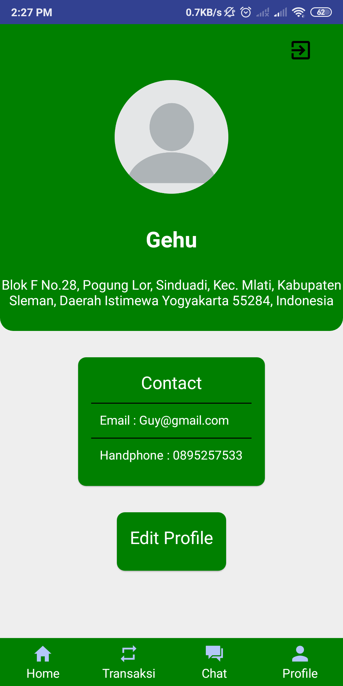

<h1 align="center">PasarQ</h1>

  

  Built with React Native.

## Table of Contents

- [Introduction](#introduction)
- [Features](#features)
- [Requirements](#requirements)
- [Usage](#usage-for-development)
- [Screenshots](#screenshots)
- [Related Project](#related-project-backend)
- [Contributors](#contributors)

## Introduction
PasarQ is an is an application to shop to make it easier to shop at the nearest local market without about crowded from the market just use the  PasarQ, you can shop to the market without having to go to the market.

## Features
* Users can buy and sell at one account
* you can track where your order
* 1 hour delivery services
* And others

## Requirements
* [`npm`](https://www.npmjs.com/get-npm)
* [`react-native`](https://facebook.github.io/react-native/docs/getting-started)
* [`react-native-cli`](https://facebook.github.io/react-native/docs/getting-started)
* [`PasarQ RESTful API`](https://github.com/muhammadrisano/Pasar-Qita-Backend-Express.git)

## Usage for development
1. Open your terminal or command prompt
2. Type `git clone https://github.com/rizkigumilar/Frontend-PasarQ.git`
3. Open the folder and type `npm install` for install dependencies
4. Before run this, you must run backend first
5. Type `react-native run-android` for run this app. ***Make sure your device is connected with debugging mode***.

## Screenshots

        
    
    
     
    
    
    
    
    

## Related Project (Backend)
* [PasarQ RESTful API](https://github.com/muhammadrisano/Pasar-Qita-Backend-Express.git)

## Trello
You can see the Trello for this project [`here`](https://trello.com/b/1CmpyTfb/faraday-pasarq)

## Contributors

  <table>
    <tr>
      <td align="center">
        <a href="https://github.com/muhammadrisano">
           
          <b>Muhammad Risano Akbar</b>
        </a>
      </td>
      <td align="center">
        <a href="https://github.com/kampretosjr">
           
          <b>Khadam Ikhwanus shofa</b>
        </a>
      </td>
        <td align="center">
        <a href="https://github.com/Arizal-Arkan">
           
          <b>Arizal Arkan</b>
        </a>
      </td>
      <td align="center">
        <a href="https://github.com/rezhariansyah">
           
          <b>Reza Riansyah </b>
        </a>
      </td>
      <td align="center">
        <a href="https://github.com/rizkigumilar">
           
          <b>Rizki Gumilar</b>
        </a>
      </td>
    </tr>
  </table>

